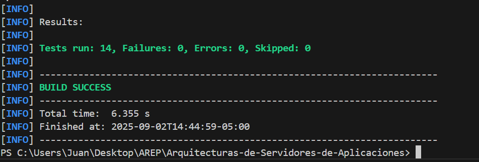

# MicroSpringBoot
## Spring Boot + Docker + AWS

This project consists of creating a minimal web application with Spring Boot, packaging it into a Docker container, publishing the image on DockerHub, and finally deploying it on an AWS virtual machine.

## Overview

### Web Application with Spring Boot

A basic REST service is developed in Java using Maven and Spring Boot.

### Docker Container

A Docker image is created from the application, containers are built, and docker-compose is configured to spin up additional services.

### Publishing on DockerHub

The generated image is pushed to a public/private repository on DockerHub.

### Deployment on AWS

A virtual machine is set up in AWS, Docker is installed, and the uploaded image from DockerHub is deployed.

## Architecture

The project contains the following main packages:

### co.escuelaing.arep.microspringboot

    MicroSpringBoot.java → Main class that starts the server.

### co.escuelaing.arep.microspringboot.httpServer

    HttpServer.java → HTTP server in charge of:

    * Dynamically registering routes.
    * Handling GET requests.
    * Serving static files.

    HttpRequest.java → Parses the URL and query parameters (?x=10&y=5).

    HttpResponse.java → Manages headers and response content type.

### co.escuelaing.arep.microspringboot.annotations

    @RestController → Annotation to mark classes as REST controllers.

    @GetMapping → Annotation to map methods to HTTP GET routes.

    @RequestParam → Annotation to extract query parameters from the URL.

### co.escuelaing.arep.microspringboot.examples

    GreetingController.java → Example web application exposing the following endpoints:

        * /greeting?name=Juan → Returns a greeting.
        * /sum?x=5&y=7 → Returns the sum of two numbers.
        * /pi → Returns the value of π.

## Installation & Execution (Local)
Build the project

    mvn clean package

Run the server

    java -cp target/classes co.escuelaing.arep.microspringboot.MicroSpringBoot

The server will start at:
    http://localhost:8080

## Example Endpoints (Local)

```plaintext
Method	    URI	            Description	                        Example Usage
GET	        /greeting	    Returns a greeting	                /greeting?name=Juan → Hello Juan
GET	        /sum	        Returns the sum of two integers	    /sum?x=10&y=5 → Result: 15
GET	        /pi	            Returns the value of PI	            /pi → 3.141592653589793
```


You can also serve static files from the webroot/public folder.
Example:

    http://localhost:8080/index.html
    http://localhost:8080/images/fondo.jpg
    http://localhost:8080/images/fondo.png

## Execution & Endpoints (Cloud) 

In the root folder, you will find a video (Lab-04-Endpoints) demonstrating the tests performed on the following endpoints :

    http://ec2-54-85-29-6.compute-1.amazonaws.com:42000/
    http://ec2-54-85-29-6.compute-1.amazonaws.com:42000/greeting?name=Juan
    http://ec2-54-85-29-6.compute-1.amazonaws.com:42000/sum?x=10&y=5 
    http://ec2-54-85-29-6.compute-1.amazonaws.com:42000/pi

## Test
 mvn test
 


## 👨Author

    Juan David Rodríguez
    Academic project for the course Enterprise Architectures (AREP) – Escuela Colombiana de Ingeniería.
